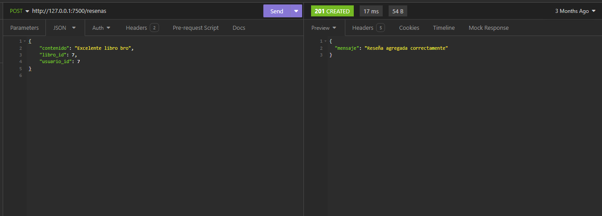
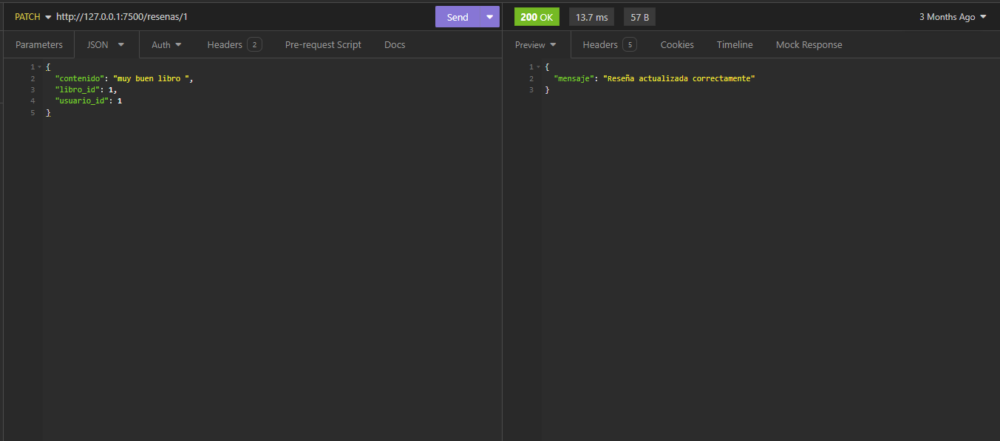
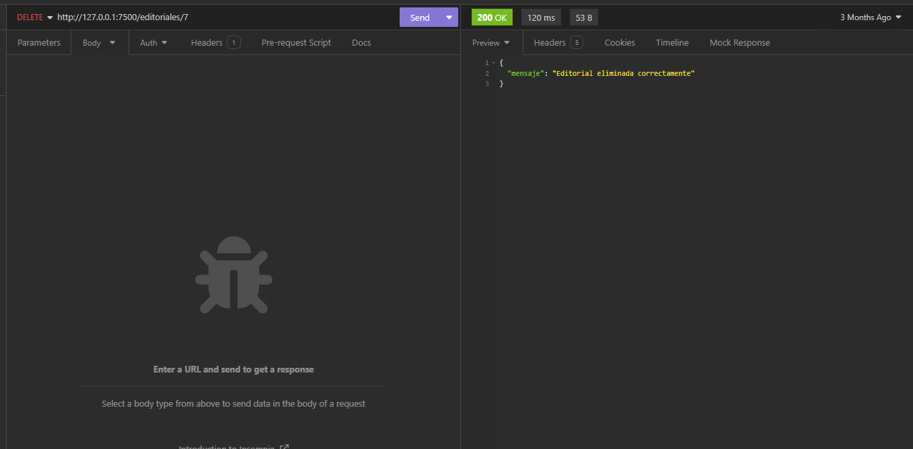
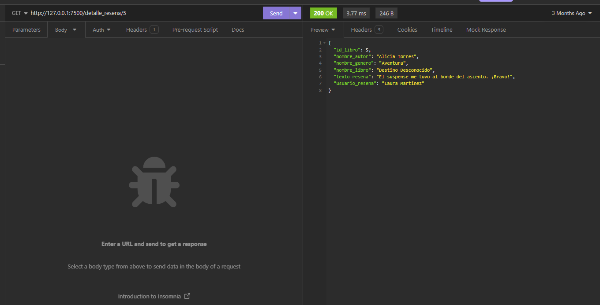

# Aplicación de Python e interfaz de Tkinter para agregar usuarios
He desarrollado este proyecto con el objetivo de aplicar y mejorar mis habilidades en el desarrollo de aplicaciones utilizando Python como lenguaje principal. Esta aplicación incluye funcionalidades para agregar, modificar, eliminar y obtener datos, utilizando una base de datos MySQL para el almacenamiento de información. La API gestionará datos relacionados con libros, usuarios y reseñas.

Para interactuar con todas estas funcionalidades, se puede utilizar Insomnia, una aplicación que facilita el trabajo con APIs.

## 💻 Tecnologias:
- Python

## ⚙️ Funcionalidades:
**Agregar datos (METODO POST):** La API permite agregar nuevos datos y tiene una ruta para cada informacion de la librería:
- Ruta para agregar un nuevo usuario
- Ruta para agregar un nuevo autor
- Ruta para agregar un nuevo género
- Ruta para agregar una nueva editorial
- Ruta para agregar un nuevo libro
- Ruta para agregar una nueva reseña

- **Editar datos (METODO PACTH):** Este metodo permite editar la informacion registrada previamente en cada una de las rutas.

- **Eliminar datos (METODO DELETE):** La API tiene la funcionabilidad de eliminar la informacion que ya fue registrada en la base de datos usando rutas al igual que los dos metodos anteriores.
 
- **Obtener datos (METODO GET):** Con el metodo get podemos obtener una información especifica otra la información relacionada con respecto a id en especifico.

## ⚙ Inicialización:
Para iniciar este proyecto, es necesario tener Python instalado en su computadora. Posteriormente, podrá ejecutar la aplicación desde su editor de código seleccionando la opción "run Python file". Es importante que cree la base de datos MySql, la cual esta disponible en uno de los archivos de este repositorio, luego de esto la API estara lista para funcionar y necesita una aplicacion como insomnia para ver su funcionalidad. Es importante tomar en cuenta que iniciar Mysql desde la aplicacion XAMPP.
